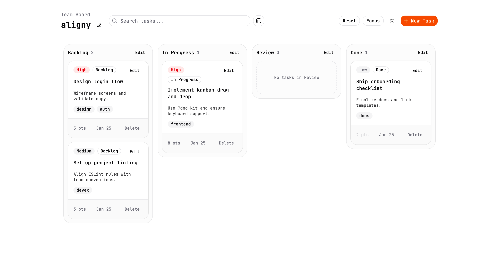

<div align="center">
  
</div>

# aligny

[aligny](https://aligny.netlify.app/) is a front-end only Kanban board designed to keep software teams organized. It runs entirely in the browser and persists data in localStorage.

## Features

- Editable columns (default: Backlog, In Progress, Review, Done)
- Task cards with title, description, priority, tags, estimate, status, and creation date
- Create, edit, and delete tasks
- Drag and drop across columns and within columns (mouse and keyboard)
- Search and filter by text, tags, and priority
- Empty states for columns with no tasks
- Light/Dark theme toggle
- Focus mode for compact standup views
- Local persistence with schema versioning

## How It Works

- All data lives in memory and is saved to localStorage.
- Tasks are organized by columns. Each column stores an ordered list of task IDs.
- Drag and drop uses @dnd-kit to update task order or move tasks between columns.
- Filters apply client-side to the tasks shown in each column.
- The theme toggle updates the `dark` class on the `html` element and persists the choice.
- Reset removes all tasks from the current board.

## Tech Stack

- Vite + React 19 + TypeScript (strict)
- Tailwind CSS v4 with shadcn/ui styles
- @base-ui/react primitives (shadcn/ui setup)
- @dnd-kit/core and @dnd-kit/sortable for drag and drop

## Local Development

Install dependencies:

```bash
bun install
```

Run the dev server:

```bash
bun run dev
```

Build for production:

```bash
bun run build
```

## Notes

- This project does not include any backend, API, database, or auth.
- Data is local to the browser and can be cleared by resetting the board or clearing localStorage.

## Screenshots

<div align="center">
  
</div>

<div align="center">
  
</div>
